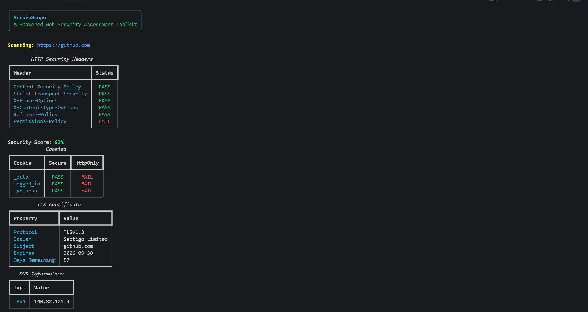
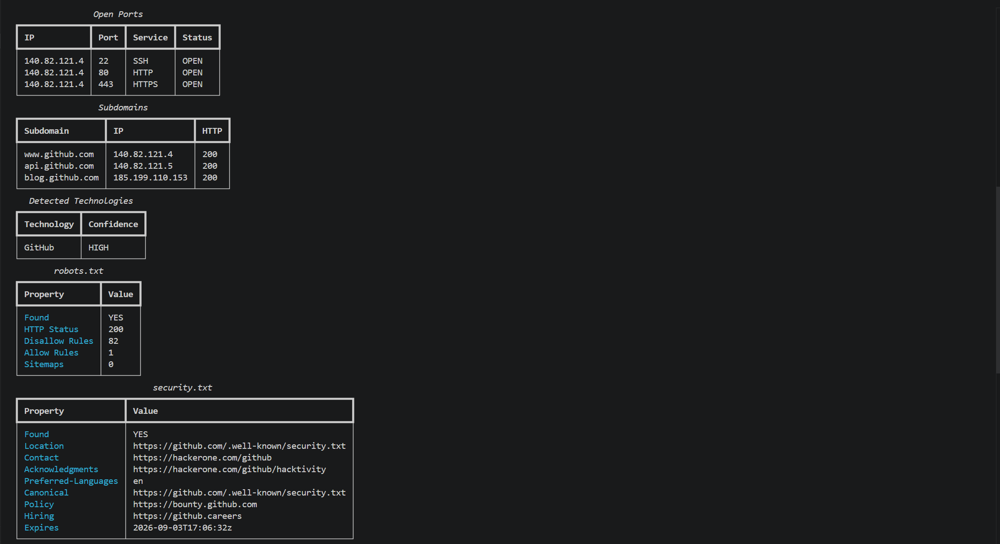
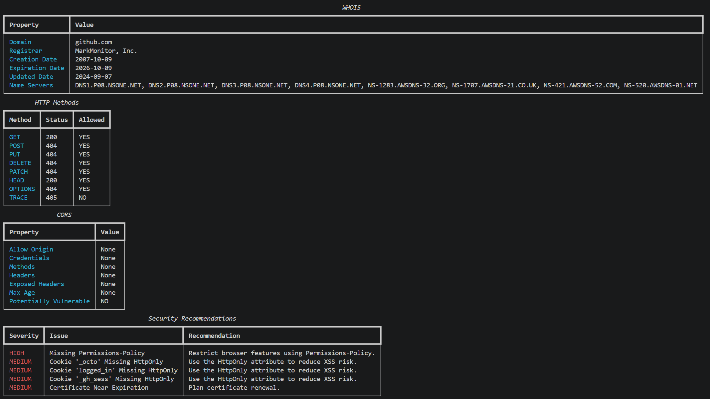

# SecureScope


AI-powered Web Security Assessment Toolkit for analyzing the security posture of web applications.

---

## Features

- HTTP Security Headers Analysis
- Cookie Security Checks
- TLS Certificate Inspection
- DNS Lookup
- Common Port Scanner
- Subdomain Discovery
- Technology Detection
- robots.txt Analysis
- security.txt Analysis
- WHOIS Lookup
- HTTP Methods Detection
- CORS Analysis
- Security Recommendations
- HTML Report Export
- JSON Report Export
- CSV Report Export

---

## Installation

```bash
git clone https://github.com/mohamedmoatazsec/SecureScope.git
cd SecureScope
pip install -r requirements.txt
```

---
## Requirements

- Python 3.9+
- requests
- rich
- colorama
- python-whois

---


## Usage

```bash
python cli.py https://github.com
```

Generate HTML report:

```bash
python cli.py https://github.com --html
```

Generate JSON report:

```bash
python cli.py https://github.com --json
```

Generate CSV report:

```bash
python cli.py https://github.com --csv
```

---

## Demo

<p align="center">
  
</p>

### More Output

<p align="center">
  
</p>

<p align="center">
  
</p>

---

## Project Structure

```
SecureScope/
│
├── securescope/
├── tests/
├── .github/workflows/
├── cli.py
├── requirements.txt
├── README.md
└── LICENSE
```

---

## Built With

- Python
- Rich
- Requests
- Socket
- SSL
- GitHub Actions

---

## Roadmap

- [x] HTTP Security Headers
- [x] TLS Scanner
- [x] DNS Lookup
- [x] Port Scanner
- [x] Subdomain Scanner
- [x] Technology Detection
- [x] robots.txt Scanner
- [x] security.txt Scanner
- [x] WHOIS Lookup
- [x] HTTP Methods Detection
- [x] CORS Analysis
- [x] Security Recommendations
- [x] HTML / JSON / CSV Reports
- [ ] WAF Detection
- [ ] CVE Detection
- [ ] SSL Rating
- [ ] GeoIP Lookup
- [ ] AI Risk Scoring

---

## Contributing

Contributions are welcome.

1. Fork the repository
2. Create your feature branch
3. Commit your changes
4. Push your branch
5. Open a Pull Request

---

## License

This project is licensed under the MIT License.


---

## Support

If you find this project useful, please consider giving it a ⭐ on GitHub.